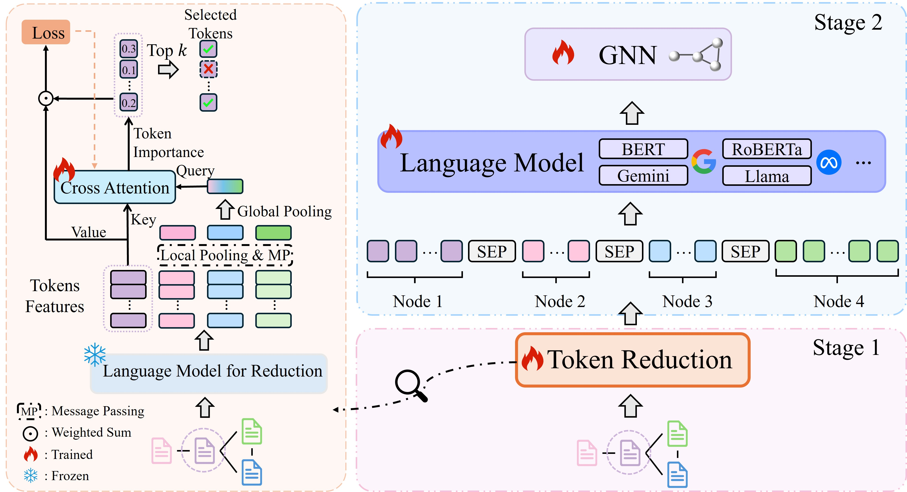

# Bridging Local Details and Global Context in Text-Attributed Graphs

**Official implementation of paper**  <br>[Bridging Local Details and Global Context in Text-Attributed Graphs](https://arxiv.org/abs/2406.12608) <br>

Yaoke Wang*, Yun Zhu*, Wenqiao Zhang†, Yueting Zhuang, Yunfei Li, Siliang Tang

In EMNLP (Main) 2024

## Overview

We propose GraphBridge, which seamlessly integrates both local and global perspectives through incorporating contextual textual information. A graph-aware token reduction module is used to maintain scalability and efficiency.



## Requirements

The core packages are as below:

* numpy==1.26.2
* torch==2.1.0+cu121
* torch-cluster==1.6.3+pt21cu121
* torch_geometric==2.4.0
* torch-scatter==2.1.2+pt21cu121
* torch-sparse==0.6.18+pt21cu121
* torch-spline-conv==1.2.2+pt21cu121
* torchmetrics==1.3.2
* transformers==4.36.2
* accelerate==0.25.0

## Datasets

For `citeseer, wikics, photo` datasets, you can download them from [link](https://drive.google.com/drive/folders/1bSRCZxt0c11A3717DYDjO112fo_zC8Ec?usp=sharing) and put them in `preprocessed_data/new`.
And you can download other datasets with raw text in [https://github.com/XiaoxinHe/TAPE](https://github.com/XiaoxinHe/TAPE) and put them into `datasets` dir.

## Runing Commands

### Reduction module training

```
CUDA_VISIBLE_DEVICES=0 python train_reduction.py --dataset cora --reduction_lm_type roberta-base --lr 1e-3 --batch_size 256 --epochs 100 --earlystop --patience 10 --hops 2
```

### Language models training

```
CUDA_VISIBLE_DEVICES=0 python train_lm.py --dataset cora --reduction_lm_type roberta-base --lm_type roberta-base --use_reduction --lr 5e-5 --epochs 4 --runs 1 --walk_steps 16 --batch_size 12
```

### GNNs training

```
CUDA_VISIBLE_DEVICES=0 python train_gnn.py --dataset cora --runs 10 --lm_type roberta-base --lr 0.01 --layer_num 2 --dropout 0.2 --batch_size 256 --label_smoothing 0.3 --earlystop --patience 20
```
